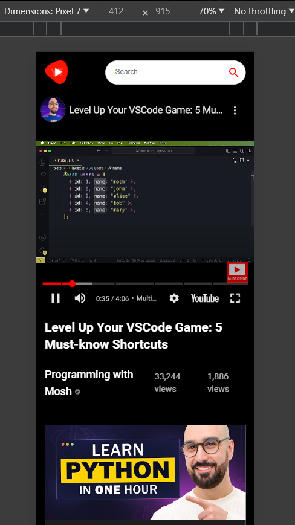

# StreamNet

StreamNet is a web application built with React + Vite and enhanced with Material-UI (MUI). It utilizes RapidAPI's YouTube v3 API for video rendering. The app is designed to allow users to view videos, live streams, and search for videos seamlessly. It is responsive, adapting its layout based on the device screen size.


## Features

- View trending videos and live streams.
- Search for videos by keywords.
- Responsive design for optimal viewing on various devices.

## Live Demo

Check out the live demo: [StreamNet Live Demo](https://streamNet.netlify.app)

## Technologies Used

- React + Vite
- RapidAPI YouTube v3 API
- Material-UI (MUI)
- Netlify for Deployment

## Screenshots

### Home Page


### Video Player


### Channel View


### Search Results


### Responsive Layouts

#### Ipad Mini


#### Samsung Galaxy S20 Ultra


#### Mobile Video Player


## Installation

To run StreamNet locally, follow these steps:

1. Clone the repository:
   ```bash
   git clone https://github.com/your-username/streamNet.git
    ```
2. Navigate to the project directory:
    ```
    cd StreamNet
    ```

3. Install dependencies:
    ```
    npm install
    ```
4. Set up RapidAPI YouTube v3 API Key:

    - Obtain an API key from [RapidAPI](https://rapidapi.com/hub).

    - Create a .env file in the root directory.

    - Add your API key to the .env file:
    ```
    VITE_RAPID_API_KEY = "your_rapid_api_key"
    ```

5. Start the server:
    ```
    npm run dev
    ```

6. Open [http://localhost:5173/](http://localhost:5173/) in your browser to view the app.

## Deployment

Streamnet is deployed using Netlify. For deployment, run:
```
npm run build
```
This command builds the project into the dist directory, which can then be deployed to any hosting service.

## Contributing

Contributions are welcome! Please fork the repository and submit a pull request with your improvements.
