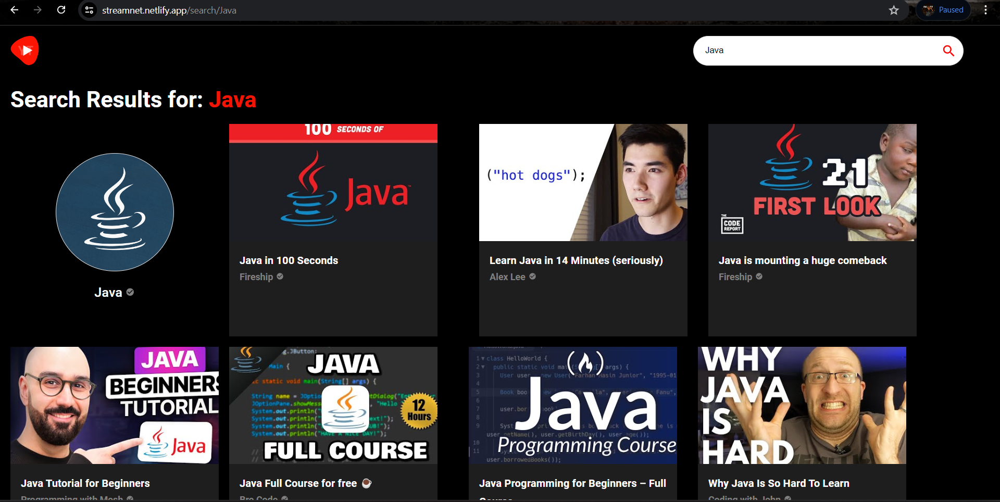
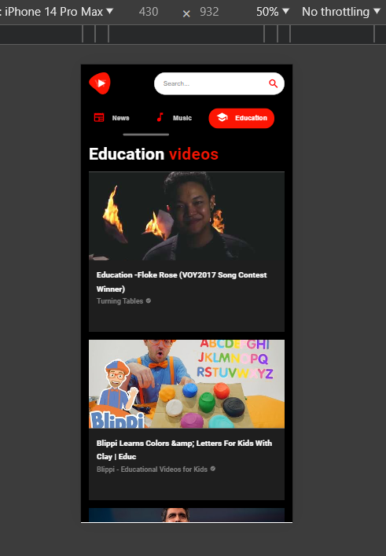

# StreamNet

StreamNet is a web application built with React + Vite. It utilizes RapidAPI's YouTube v3 API for video rendering. The app is designed to allow users to view videos, live streams, and search for videos seamlessly. It is responsive, adapting its layout based on the device screen size.


## Features

- View trending videos and live streams.
- Search for videos by keywords.
- Responsive design for optimal viewing on various devices.

## Live Demo

Check out the live demo: [Streamnet Live Demo](https://streamnet.netlify.app)

## Technologies Used

- React + vite
- RapidAPI YouTube v3 API

## Screenshots

### Home Page


### Video Player


### Search Results


### Responsive Layouts



## Installation

To run Streamnet locally, follow these steps:

1. Clone the repository:
   ```bash
   git clone https://github.com/your-username/streamnet.git
   cd streamnet
